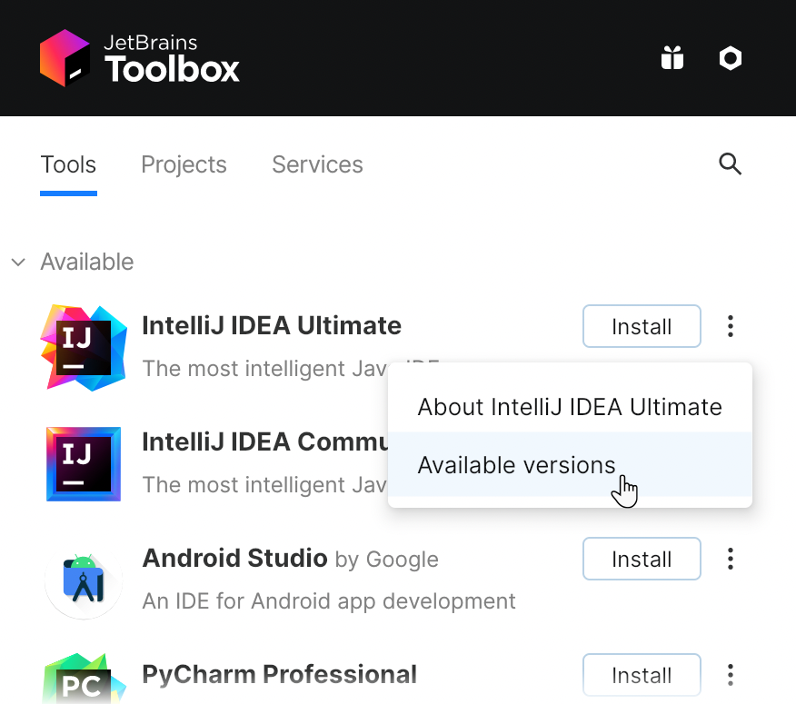

# IntelliJ IDEA

### Official Download Links

<table data-card-size="large" data-view="cards"><thead><tr><th></th><th data-hidden></th><th data-hidden></th><th data-hidden data-type="content-ref"></th><th data-hidden data-card-target data-type="content-ref"></th><th data-hidden data-card-cover data-type="files"></th></tr></thead><tbody><tr><td>Windows 64 Bit</td><td></td><td></td><td><a href="https://www.jetbrains.com/toolbox-app/download/download-thanks.html?platform=windows">https://www.jetbrains.com/toolbox-app/download/download-thanks.html?platform=windows</a></td><td><a href="https://www.jetbrains.com/toolbox-app/download/download-thanks.html?platform=windows">https://www.jetbrains.com/toolbox-app/download/download-thanks.html?platform=windows</a></td><td><a href="../../.gitbook/assets/windows-logo.png">windows-logo.png</a></td></tr><tr><td>Linux 64 Bit</td><td></td><td></td><td><a href="https://www.jetbrains.com/toolbox-app/download/download-thanks.html?platform=linux">https://www.jetbrains.com/toolbox-app/download/download-thanks.html?platform=linux</a></td><td><a href="https://www.jetbrains.com/toolbox-app/download/download-thanks.html?platform=linux">https://www.jetbrains.com/toolbox-app/download/download-thanks.html?platform=linux</a></td><td><a href="../../.gitbook/assets/linux-logo.png">linux-logo.png</a></td></tr><tr><td>macOS 64 Bit (Intel)</td><td></td><td></td><td><a href="https://www.jetbrains.com/toolbox-app/download/download-thanks.html?platform=mac">https://www.jetbrains.com/toolbox-app/download/download-thanks.html?platform=mac</a></td><td><a href="https://www.jetbrains.com/toolbox-app/download/download-thanks.html?platform=mac">https://www.jetbrains.com/toolbox-app/download/download-thanks.html?platform=mac</a></td><td><a href="../../.gitbook/assets/apple-logo.svg">apple-logo.svg</a></td></tr><tr><td>macOS 64 Bit (Apple Silicon)</td><td></td><td></td><td><a href="https://www.jetbrains.com/toolbox-app/download/download-thanks.html?platform=macM1">https://www.jetbrains.com/toolbox-app/download/download-thanks.html?platform=macM1</a></td><td><a href="https://www.jetbrains.com/toolbox-app/download/download-thanks.html?platform=macM1">https://www.jetbrains.com/toolbox-app/download/download-thanks.html?platform=macM1</a></td><td><a href="../../.gitbook/assets/apple-logo.svg">apple-logo.svg</a></td></tr></tbody></table>

## Installation Steps

### Windows

* [ ] Download and install the JetBrains ToolBox app on your Windows 11 computer from the official JetBrains website: [https://www.jetbrains.com/toolbox/app/](https://www.jetbrains.com/toolbox/app/)
* [ ] Once the ToolBox app is installed, launch it and click on the "IntelliJ IDEA" icon.

<figure><figcaption></figcaption></figure>

* [ ] Click on the "Install" button to start the installation process for IntelliJ IDEA.
* [ ] Follow the prompts to complete the installation, including agreeing to the license agreement and choosing the installation location.
* [ ] Once the installation is complete, you can launch IntelliJ IDEA from the ToolBox app or by searching for it in the Start menu.

Note: These instructions assume that you are using the ToolBox app to manage your JetBrains IDE installations. If you prefer to install IntelliJ IDEA directly from the website, you can download the latest version of IntelliJ IDEA from [https://www.jetbrains.com/idea/](https://www.jetbrains.com/idea/) and follow the on-screen instructions to install it on your Windows 11 computer.

\
