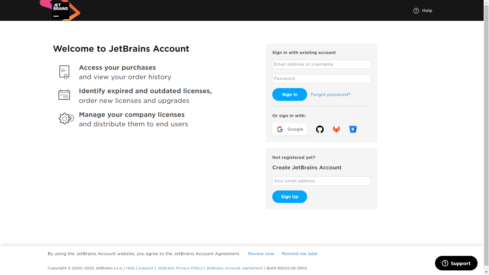

### Setting up a Java Development Environment.

---

##### What you will need

* An IDE (Integrated Development Environment) ([IntelliJ IDEA](https://www.jetbrains.com/idea/) preferred)
* [The JDK](jdk.md)
* Git
* GitHub/GitLab account
* A laptop/desktop with these configurations is good to have, you may work with a lower configuration but might
  experience some issues later.
    * Operating System (officially released 64-bit versions of the following):
        * Microsoft Windows 10 or later
        * macOS 11 (Big Sur) or later
        * Any Linux distribution that supports Gnome, KDE, or Unity DE.
    * RAM: 2 GB of free RAM (minimum), 8 GB of total system RAM (minimum)
    * CPU: Any modern CPU like Intel i3, i5, i7 or i9 (8th Generation or above), or AMD Ryzen 3, 5, or 7
      (4XXX series or above)
    * HDD/SSD: 2.5 GB free and 1.5 GB for caches (minimum)

---

##### Instructions for Installation

1. Open your favorite web browser (Chrome/Edge/Brave) on your computer and go to
   [JetBrains' official website](https://www.jetbrains.com/).

2. On the top, find the "human" icon and click it to create a new account, or sign in if you already have one.
   

3. You will see this page, enter your email address in the box for **Create JetBrains Account**, then click on sign
   up.  
   

4. 